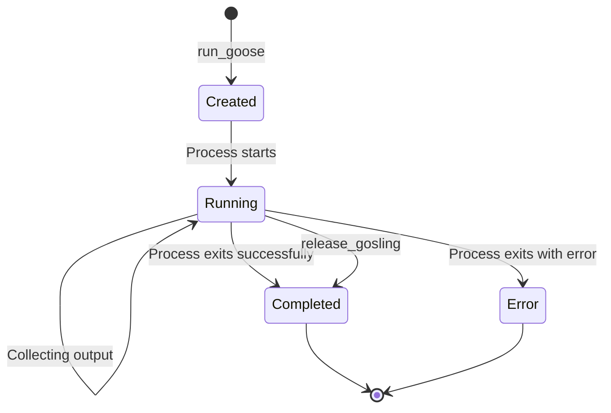
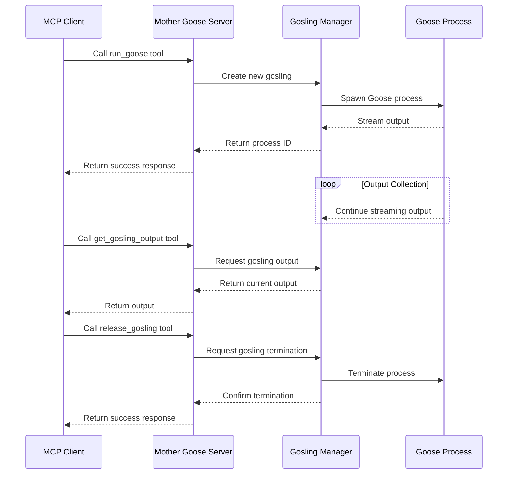

# Architecture Reference

This document describes the architecture of the Mother Goose MCP server.

## System Architecture

Mother Goose follows a modular architecture designed to manage multiple Goose CLI processes and expose them through the Model Context Protocol (MCP).

```
┌─────────────────┐      ┌───────────────────┐
│                 │      │                   │
│   MCP Client    │◄────►│   Mother Goose    │
│   (e.g. Claude) │      │   MCP Server      │
│                 │      │                   │
└─────────────────┘      └───────┬───────────┘
                                 │
                                 ▼
                         ┌───────────────────┐
                         │                   │
                         │ Gosling Processes │
                         │ (Child Goose CLI) │
                         │                   │
                         └───────────────────┘
```

## Components

The system consists of the following main components:

### 1. MCP Server

The core of Mother Goose is an MCP server that implements the Model Context Protocol. It:

- Handles MCP requests and responses
- Registers resource and tool handlers
- Manages server lifecycle

Implemented in: `src/index.ts`

### 2. GoslingManager

The GoslingManager is responsible for:

- Creating new Goose processes (goslings)
- Tracking gosling status and lifecycle
- Collecting process output
- Terminating processes when requested

Implemented in: `src/gosling-manager.ts`

### 3. Request Handlers

Request handlers process incoming MCP requests:

- Resource handlers provide access to gosling information and output
- Tool handlers enable creation, listing, and management of goslings

Implemented in: `src/handlers.ts`

### 4. Utilities

Utility functions provide:

- Checking for Goose CLI installation
- Date and time formatting
- Helper functions

Implemented in: `src/utils.ts`

## Process Lifecycle



1. **Creation**: A gosling is created using the `run_goose` tool.
2. **Running**: The gosling process runs and produces output.
3. **Completion**: The gosling completes naturally or is released.
4. **Error**: The gosling may end with an error status.

## Data Flow



## Communication Protocol

Mother Goose implements the Model Context Protocol (MCP), which provides:

1. **Tool Definition**: Tools are defined with names, descriptions, and input schemas.
2. **Resource Definition**: Resources are defined with URIs, MIME types, and descriptions.
3. **Request Handling**: Server handles incoming requests and routes them to appropriate handlers.
4. **Response Formatting**: Responses are formatted according to MCP specifications.

## Process Management

Goose processes are managed using Node.js's `child_process` module:

1. **Creation**: Processes are created using `spawn()` with appropriate arguments.
2. **Output Collection**: Standard output and error streams are collected asynchronously.
3. **Termination**: Processes can be terminated using the `kill()` method.

## Error Handling

Mother Goose implements comprehensive error handling:

1. **Validation**: Input parameters are validated before use.
2. **Process Errors**: Errors from gosling processes are captured and reported.
3. **MCP Errors**: Standard MCP error codes are used for client communication.
4. **System Errors**: System-level errors are caught and handled gracefully.

## Configuration

Mother Goose is designed to work with minimal configuration:

1. **Environment Variables**: Processes inherit environment variables from the parent.
2. **Command Line Options**: Basic options are available for help, version, and validation.
3. **MCP Client Configuration**: Configuration is primarily done in the MCP client settings.

## See Also

- [Installation Guide](../getting-started/installation.md)
- [Configuration Guide](../getting-started/configuration.md)
- [API Reference](../api/gosling-manager.md)