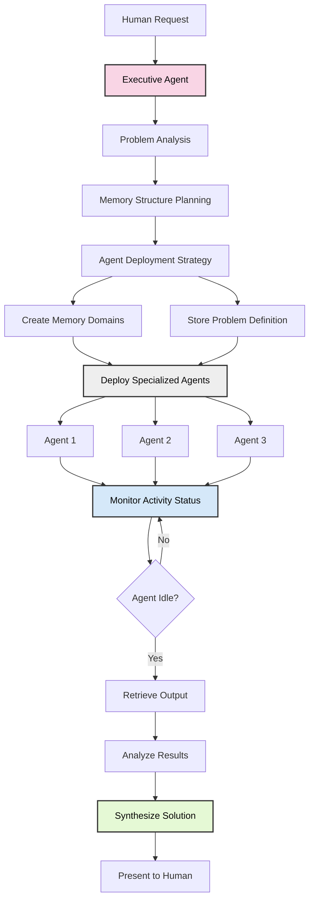
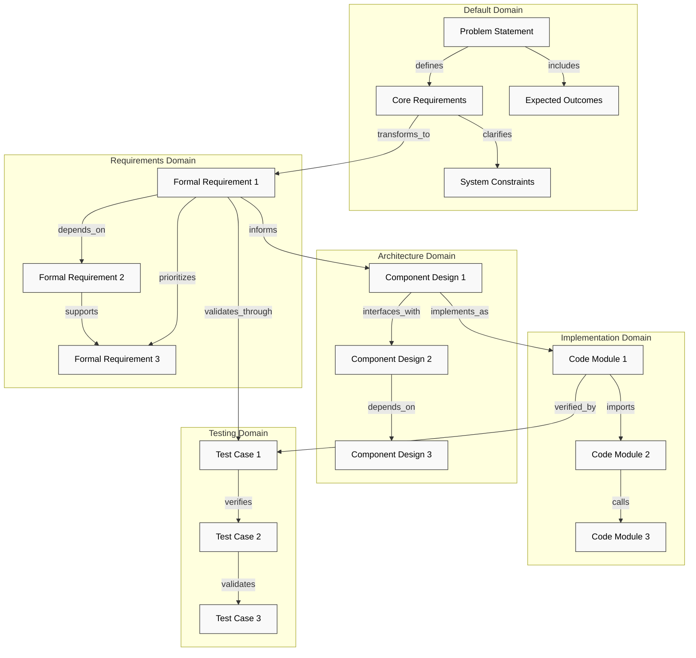
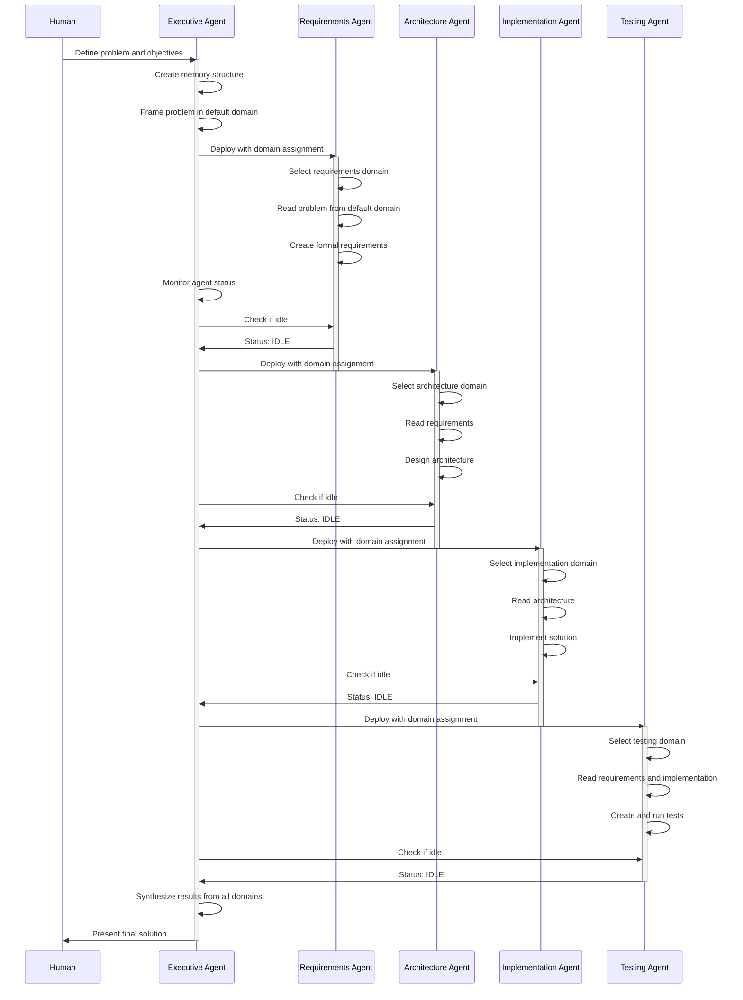

# Advanced Usage

This guide covers advanced usage patterns and scenarios for Mother Goose.

## Recursive AI Workflows

One of the most powerful features of Mother Goose is the ability to create recursive AI workflows, where an agent can spawn multiple child processes to work on different aspects of a complex problem.

### Multi-Agent Collaboration

You can create multiple specialized agents to collaborate on a complex task:

```
I need to solve a complex machine learning problem. Use the run_goose tool to create three specialist goslings:
1. One to research the latest papers on this topic
2. One to design an experimental approach
3. One to draft code snippets for implementation

Then, I'll coordinate their efforts to produce a comprehensive solution.
```

### Divide and Conquer

For large problems, you can divide them into smaller sub-problems:

```
Use the run_goose tool to break down the problem of optimizing this large codebase into:
- Identifying performance bottlenecks
- Suggesting refactoring opportunities
- Improving algorithmic efficiency
```

Then, you can collect and synthesize the results from each gosling.

## Orchestrated Multi-Agent Workflows

Mother Goose provides a sophisticated framework for orchestrating multi-agent workflows with shared memory, enhancing collaboration and goal alignment between agents. By leveraging the executive agent framework, you can implement complex, coordinated workflows that maximize the effectiveness of specialized agents working toward a common goal.

### Executive Agent Orchestration Flow

The following diagram illustrates the typical flow of an orchestrated multi-agent workflow using the executive agent framework:



This orchestration flow demonstrates how the executive agent manages the entire process from initial problem analysis through to solution synthesis, coordinating specialized agent activities throughout.

### Memory Graph-Based Planning

At the core of effective multi-agent orchestration is memory graph-based planning. This approach enables the supervisor agent to define a comprehensive knowledge structure before deploying specialized agents. By first mapping the problem space as interconnected memories in a graph structure, the supervisor creates a shared understanding that all child agents can access and contribute to. 

This planning phase transforms abstract problems into concrete, navigable knowledge landscapes. The supervisor agent establishes domain-specific memory areas and lays out the semantic relationships between concepts. When specialized agents begin their work, they inherit this structured context rather than starting from scratch, allowing them to immediately understand how their specific tasks relate to the broader objectives. As they explore solutions, they can follow existing relationship paths to discover relevant information, while also adding new connections that enrich the collective knowledge.

This proactive structuring of the problem space dramatically improves coordination efficiency by providing agents with a pre-established mental model of the task. It reduces redundant exploration and creates a foundation for consistent understanding across all participants in the workflow.

### Memory Graph Relationship Structure

The following diagram illustrates how knowledge is organized and flows between different memory domains in a typical orchestrated workflow:



This diagram shows how memories are connected both within and across domains. Edge relationships like "transforms_to," "informs," "implements_as," and "validates_through" create semantic pathways that guide agent exploration and reasoning.

### Edge Nodes for Directive Semantic Discovery

The executive agent framework introduces the concept of edge nodes for directive semantic discovery within memory graphs. These relationship edges serve as navigational pathways that guide agents through the knowledge landscape with intent and purpose. Each edge type—whether "relates_to," "supports," "synthesizes," or "refines"—carries semantic meaning about how knowledge elements connect.

When designing these edge relationships, the supervisor agent creates a network of directional signposts that not only connect information but suggest how it should be traversed and utilized. For instance, a "synthesizes" edge connects disparate concepts into cohesive insights, while a "supports" edge establishes evidential backing between assertions. Through these edge types, agents receive implicit guidance about the relative importance of different knowledge paths and how information elements should be interpreted in relation to each other.

This semantic layer transforms the memory graph from a mere storage mechanism into an active component of reasoning. As agents navigate these directed pathways, they gain insights into which connections matter most for their assigned tasks. The edge structure serves as a collaborative inference mechanism that subtly directs exploration while still allowing for creative discovery, balancing guidance with autonomy in a way that traditional instruction-based approaches cannot achieve.

### Agent Deployment and Coordination Sequence

The following diagram illustrates the sequence of agent deployment and coordination in an orchestrated workflow:



This sequence diagram shows how the executive agent coordinates the deployment of specialized agents, monitoring their status, and orchestrating their interactions to ensure that each agent works with the outputs of previous agents, creating a cohesive workflow.

### Agent Goal Alignment Through Memory Structuring

One of the most powerful benefits of memory graph orchestration is how it naturally aligns agent goals with human intentions. By establishing a shared memory structure with clear domains and relationships, the supervisor agent creates an environment where specialized agents can understand not just their immediate tasks but how those tasks serve the broader objective. This shared context ensures that even as agents work independently, they remain oriented toward the same ultimate goals.

Memory structuring enables goal alignment through several mechanisms. First, it provides a common reference point that all agents can access, ensuring consistent understanding of the problem statement and evaluation criteria. Second, it creates natural dependencies between agent domains that encourage cooperation rather than isolated work. Finally, it allows agents to see how their contributions build upon and complement the work of others, fostering a collaborative rather than competitive approach.

This alignment happens without requiring extensive explicit instructions. The structure itself guides agent behavior in ways that reflect the supervisor's (and by extension, the human's) intentions. Agents working within this framework naturally prioritize actions that build constructively on existing knowledge and avoid paths that diverge from the established direction. The result is a system where specialized expertise serves collective goals by design, narrowing the alignment gap that traditionally challenges multi-agent systems.

### The Executive Agent Framework

Mother Goose provides a pre-configured prompt template for the executive agent role. This framework guides the orchestration process through several distinct phases:

1. **Initial Discovery Phase** - Understanding the problem space and requirements
2. **Problem Framing** - Defining the problem clearly in structured memory
3. **Agent Deployment Strategy** - Deploying specialized agents with precise role definitions
4. **Memory Organization** - Creating and maintaining domain-specific memory structures
5. **Coordination Phase** - Monitoring agent activity and orchestrating their interactions
6. **Integration Phase** - Synthesizing findings into a comprehensive solution

You can access this prompt template through the resource system:

```
Access the resource at prompts://executive-agent
```

### Orchestration Workflow Example

Here's a comprehensive example of an orchestrated workflow using memory domains for a software development project:

```
# Step 1: Initialize the memory structure
Use mcp__memorygraph__create_domain to create domains for "requirements", "architecture", "implementation", and "testing"

# Step 2: Frame the problem in the default domain
Store a clear problem statement with structured relationship edges in the default domain
Add semantic connections between key concepts to create a navigable problem space

# Step 3: Deploy specialized goslings
Use the run_goose tool to create a requirements analyst that reads customer needs and formalizes them in the "requirements" domain:
"You are the Requirements Analyst responsible for formalizing customer needs. Select your primary domain 'requirements'. Review the problem context in the default domain. Create formal requirements with clear relationships to customer needs."

Use the run_goose tool to create an architect that designs based on requirements:
"You are the System Architect responsible for high-level design. Select your primary domain 'architecture'. Review requirements from the 'requirements' domain. Create an architecture that satisfies all requirements, establishing clear relationships to each requirement."

Use the run_goose tool to create implementation specialists for different components:
"You are the Implementation Specialist for [component]. Select your primary domain 'implementation'. Review the architecture from the 'architecture' domain. Implement code that aligns with the architectural design, creating relationships to specific architecture elements."

Use the run_goose tool to create a testing specialist:
"You are the Testing Specialist responsible for validation. Select your primary domain 'testing'. Review requirements from the 'requirements' domain and implementation from the 'implementation' domain. Create test cases that verify requirements are met, with relationships to both requirements and implementation."

# Step 4: Coordinate and monitor
Use get_gosling_status to monitor which goslings are active/idle
Only retrieve outputs with get_gosling_output when an agent is idle

# Step 5: Integration
Once all agents have completed their work, review the memory graph
Traverse relationships between domains to ensure requirements flow through to implementation
Generate a final report highlighting how all components connect and satisfy the original requirements
```

This workflow creates a fully traceable development process where requirements are directly connected to architecture, implementation, and testing through semantic relationships. Each specialized agent works within its domain while contributing to the collective knowledge graph.

## Using Custom Options

When spawning a gosling, you can provide custom options via the `options` parameter:

```
Use the run_goose tool with prompt="Research quantum computing algorithms" and options=["-t", "--max-tokens=2000"]
```

This allows you to customize the behavior of the Goose CLI process.

## Accessing Resources Directly

In addition to the tools, Mother Goose provides direct access to resources:

### Listing All Processes

```
Access the resource at goslings://list
```

### Getting Process Details

```
Access the resource at goslings://123e4567-e89b-12d3-a456-426614174000
```

### Getting Process Output

```
Access the resource at goslings://123e4567-e89b-12d3-a456-426614174000/output
```

## Handling Long-Running Processes

For complex queries that might take some time:

1. Start the process and note the ID
2. Periodically check its status with `get_gosling_status`
3. Continue with other work while waiting
4. When the status shows IDLE, retrieve the complete output
5. Integrate the results

Example:
```
# Start a complex analysis
Use the run_goose tool to analyze this large dataset...

# Later, check if it's done without retrieving the entire output
Use the get_gosling_status tool to check if process XYZ is idle yet.

# Once it shows IDLE status, retrieve the complete output
Use the get_gosling_output tool with process_id="XYZ" to see the analysis results.
```

### Activity Sensing

Mother Goose includes an activity sensing system that detects when goslings are actively generating output versus when they're idle and ready for interaction:

1. **Working Status**: A gosling is considered to be in WORKING status when it's actively generating output.
2. **Idle Status**: A gosling is considered IDLE after it has generated no new output for a threshold period (default: 2000ms).
3. **Hysteresis**: A time buffer prevents false idle detections due to temporary pauses in output generation.

This helps prevent context overwhelm by allowing you to monitor multiple goslings efficiently without needing to fetch their complete outputs until they're ready for interaction.

Example of using activity sensing to manage multiple goslings:

```
# Start multiple goslings for different aspects of a task
Use the run_goose tool to create three specialist goslings for different parts of a complex project.

# Monitor activity status with minimal context consumption
Use the get_gosling_status tool to get a compact activity report.

# For any gosling marked as IDLE:
Use the get_gosling_output tool to retrieve its complete output.
Use the send_prompt_to_gosling tool to continue the conversation if needed.

# For goslings still marked as WORKING:
Wait until a later status check shows them as IDLE.
```

## Interactive Conversations with Goslings

Mother Goose now supports multi-turn conversations with goslings, allowing for interactive workflows:

### Sending Follow-Up Prompts

After starting a gosling, you can send additional prompts to it:

```
# Step 1: Start a gosling
Use the run_goose tool with prompt="What are the fundamental principles of machine learning?"

# Step 2: Wait for initial response
Use the get_gosling_output tool with process_id="..." to see the initial response

# Step 3: Send a follow-up question
Use the send_prompt_to_gosling tool with process_id="..." and prompt="Can you elaborate on neural networks?"

# Step 4: Get updated response
Use the get_gosling_output tool again to see the combined conversation
```

### Session Persistence

Gosling sessions are automatically managed with the following features:

1. All goslings run in interactive mode with named sessions
2. If a gosling has exited, it can be automatically resumed when sending a follow-up prompt
3. Full prompt history is maintained and displayed in the output

### Paginated Output Viewing

For goslings generating large amounts of output, you can use pagination:

```
# View first 100 lines (default)
Use the get_gosling_output tool with process_id="..."

# View specific section (lines 200-300)
Use the get_gosling_output tool with process_id="...", offset=200, limit=100

# View entire output
Use the get_gosling_output tool with process_id="...", full_output=true
```

## Error Handling

Sometimes goslings may encounter errors. You can:

1. Check the gosling's status with `list_goslings`
2. Look for error messages in the output with `get_gosling_output`
3. Release the process with `release_gosling` if it's in an error state
4. Start a new process with modified parameters

## Performance Optimization

To get the best performance:

1. **Use Activity Sensing**: Use `get_gosling_status` to monitor goslings efficiently instead of repeatedly fetching complete outputs.
2. **Wait for Idle State**: Only retrieve complete outputs or send follow-up prompts when a gosling is in the IDLE state.
3. **Adjust Idle Threshold**: Customize the `idle_threshold_ms` parameter based on your specific needs (higher for more confirmation, lower for faster response).
4. **Be Specific with Prompts**: Provide clear, specific prompts to goslings for better results.
5. **Release When Done**: Always use `release_gosling` when you're done with a process to free up system resources.
6. **Limit Concurrent Processes**: Avoid spawning too many concurrent goslings to prevent resource contention.
7. **Use Meaningful Prompts**: Include descriptive task information to make identification easier in status reports.
8. **Paginate Large Outputs**: For large outputs, use pagination to view only the sections you need rather than the full content.

## Next Steps

- [Troubleshooting](./troubleshooting.md)
- [MCP Tools Reference](../reference/tools.md)
- [MCP Resources Reference](../reference/resources.md)
- [Memory Graph Repository](https://github.com/aaronsb/memory-graph)